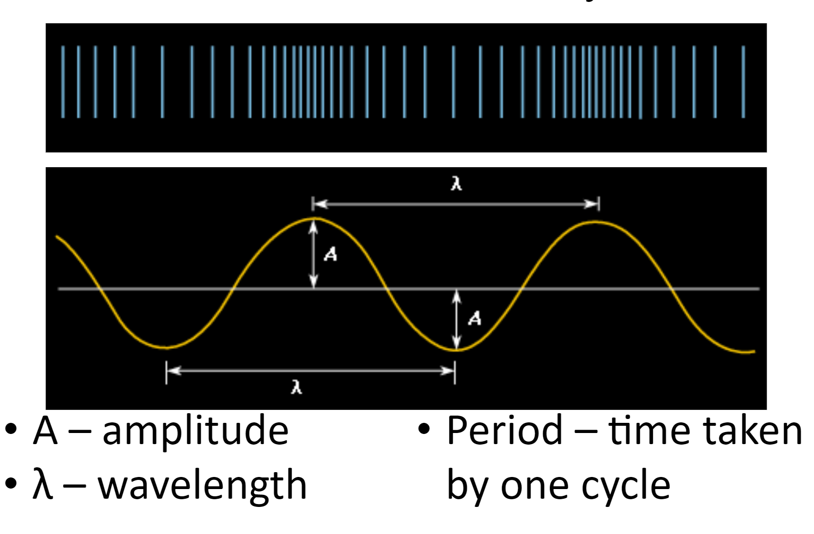
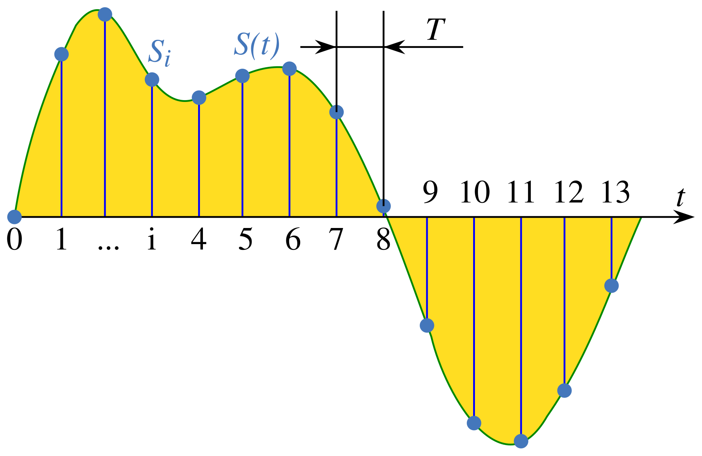
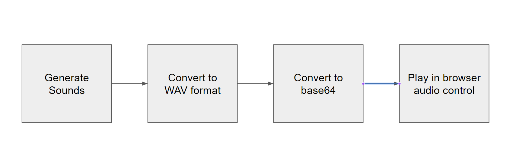

# Music Synth Coding Kata

Generate notes in your browser with Javascript, from scratch, no dependencies. Sequence 
notes into music music. Create music through live coding.

# Inspiration

* [Overtone](https://overtone.github.io/)
* [SonicPi](https://sonic-pi.net/)
* [Undertone](https://fable.io/repl/) "Samples" > "Fun and Games" > "Undertone - Programmable music"

# Sound Waves

Sound is a mechanical wave that is an oscillation of pressure transmitted through a solid, liquid, or gas, composed of frequencies within the range of hearing

Sound that is perceptible by humans has frequencies from about 20 Hz to 20,000 Hz

The below diagram shows a compression wave and chart measuring it's amplitude vs time.



## Notes

Notes are sounds at standard frequencies.

A440 is the musical note A above middle C, which has a frequency of 440 Hz and serves as a general tuning standard for musical pitch

An octave is the interval between one musical pitch and another with half or double its frequency.

If one note has a frequency of 440 Hz, the note an octave above it is at 880 Hz, and the note an octave below is at 220 Hz.

A semitone, also called a half step or a half tone, is the smallest musical interval commonly used in Western tonal music.

There eight notes in an octave, but 12 semitones.

Notes uneven distributed semitones aren’t.

| Note | Enharmonic | Semitones |
|------|------------|-----------|
| C	    |            | 0         |
| C♯   | D♭         | 1         |
| D    |            | 2         |
| E♭   | D♯         | 3         |
| E	    | F♭         | 4         |
| F    | E♯         | 5         |
| F♯   | G♭         | 6         |
| G    |            | 7         |
| G♯   | A♭         | 8         |
| A    |            | 9         |
| B♭	   | A♯         | 10        |
| B    |            | 11        |
| C    | B♯         | 12        |

## Modeling Sound

To model sound we need to model the wave. The simplest way to do this is use a collection of floats with values between 1.0 and -1.0 representing the amplitude of the wave.

To do this we first need to define a sample rate, which is the frequency at which samples will be collected / played back. The industry standard for this is 44,100Hz.

Give the sample rate, each sample in the frequence represents the amplitude of the wave at a current time. The time is calculated implicitly from the period of the sample frequency.



Source: [Sampling_(signal_processing](https://en.wikipedia.org/wiki/Sampling_(signal_processing))


## Playing Sound

Playing back the sound has 4 phases:

1. Generating the collection of floats that model the sound
1. Converting the collection of floats to WAV format
1. Convert the WAV to a base64 string
1. Pass the base64 string to a browser audio control for playback.



# The Exercise 

The exercise will concentrate how how to generate and transform sound waves.

There are two code folders:

* [src/exercise](src/exercise)
* [src/solution](src/solution)

In `exercise` some infrastructure code has been put in place:
* Help generate notes at certain frequencies
* Transform and playback the note
* Generate sequences of notes to play
    - a simple nursery rhymes
    - a chord made of three notes

The folder `solution` contains a model solution that uses exercise as a starting point.

The exercise consist of completing the below functions to be able play back the note sequences given at the end of the file.

Wave generation functions:
* sine - generates a sine wave from the phase angle
* square - generates a square wave from the phase angle
* triangle - generates a triangular wave from the phase angle
* sawtooth  - generates a right angle triangle wave from the phase angle

(See below for an explanation of phase angle)

Transformation functions:
* Transformation_scaleHeight - makes the amplitude of the wave larger or smaller
* Transformation_flatten  - cuts the wave amplitude off at a certain hight
* Transformation_tapper - applies a slope to the wave
* Transformation_combine - combines two or more notes into a chord

## Phase Angle

Once we know the sample rate, given the frequence of a note, we can calculate the rate of change change required to make an oscillation in the notes period.
This is known as the phase angle.

There's an infrastructure that will calculate the phase angle for us:

```
/**
 * make a wave using the given function, length and frequency
 */
function makeWave(waveFunc, length, frequency) {
    ...
}
```

In the `makeWave` function the parameters `length`, in samples, and `frequency` frequency, in hertz are used to calculate the phase or rate of change. The phase angle is then passed to the parameter `waveFunc`, which is the used to generate the relevant sequence of samples.

**Note:** you generally won't use the `makeWave` function directly, there's a wrapper `makeNote` which takes frequency in terms of `note` and `octave` instead of hertz.

# Going Further

If you complete the exercise and want to do more, there's a lot more you can do!

First of all, try and make some interesting music using the existing facilities.

However, the options are quite limited so here are some more transformations / effects you could implement:

* Echo
* [Reverb](https://en.wikipedia.org/wiki/Reverberation)
* [Flanging](https://en.wikipedia.org/wiki/Flanging)
* [Low frequency oscillator](https://en.wikipedia.org/wiki/Low-frequency_oscillation)

Finally, if you ger board of this simple system, the libraries [Overtone](https://overtone.github.io/) and [SonicPi](https://sonic-pi.net/) have rich sound synthesis capabilities, so explore them and make some tunes.
